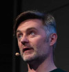



This year, we are running an optional Training Day ahead of the open space (inspired by the [Foundations day at SoCraTes Germany][socrates_de_foundations]). 

Are you new to the software industry, and want to get a head start? Have you been practicing for a while, but always thought there had to be some deeper method to it? Have you heard about test-driven development, refactoring, or connascence, and always wanted to learn more about them?

## An Extra Day

The Training Day is intended to open up the world of crafting and testing for newcomers and allow a deep-dive into certain topics. It offers a guided introduction to the conference experience. And provides an easy way to have all the questions you will probably arrive with answered by experienced practitioners.

Unlike the rest of the conference, this day does not follow the [OpenSpace Technology](https://en.wikipedia.org/wiki/Open_Space_Technology) format. The training day includes both introductory and advanced sessions. You will be able to choose which  sessions to attend, allowing you to build a program that suits your needs.

Sessions will cover foundational topics - the roots of what our community is about - taught by tenured and distinguished community members with years of practical experience. There will also be sessions that take a deeper look at these topics.

## Programme

The training day is organised around two tracks: this year *Track A* and *Track B*. Mix & match on the tracks is encouraged!

| Time | Track A | Track B |
| |  |  |
| *09:30 - 09:45* | *Welcome* | - |
|  09:45 - 10:45  | [TDD game with Cyber-Dojo](#tdd-game-with-cyber-dojo), by Jon Jagger | - |
| *10:45 - 11:00* | *Break* | - |
|  11:00 - 12:30  | [Learn C++ by example](#learn-c-by-example), by Fran Buontempo  | [Functional FizzBuzz](#functional-fizzbuzz), by Duncan McGregor |
| *12:30 - 14:00* | *Lunch* | - |
|  14:30 - 16:00  | [Intro to Systems Thinking](#intro-to-systems-thinking), by Diana Montalion and Andrew Harmel-Law | [Refactoring beyond the commit](#refactoring-beyond-the-commit) by Duncan McGregor and Nat Pryce    How you deliver a refactoring that cannot be delivered in a single commit|
| *16:00 - 16:15* | *Break* | - |
|  16:15 - 17:45  | [Ensemble/Mob facilitation](#ensemblemob-facilitation) by Clare Sudbery | [High-level design: a test-driven approach](#high-level-design-a-test-driven-approach) by Jason Gorman |
{:.table-striped}

 

### TDD game with Cyber-Dojo

Jon Jagger 

### Learn C++ by Example

Fran Buontempo 

Let’s write some C++ to play rock, paper, scissors.

We’ll get our computer to make a random choice and accept our choice and see who wins.

I suspect we need 90 mins, and people will need a laptop with suitable tooling - IDE, or editor and compiler. I can share links if needed.

*Outline*: orienteering
1. Begin - 30 to 45 mins, getting the basics:

    a) Output, starting with “Hello, world!“.

    b) input and validating input,

    c) writing a function,

    d) C++’s maybe type (optional) which means using a template.

By this point we can read a number in and do something with it, or notice a number wasn’t provided.
We have learnt about the main function, compilers, the linker, some basic syntax and have a brief glimpse at templates.
We’ll realise there are different versions of C++ and know to check if ours supports what we need.

2. End: let’s make a game, 30 to 45 mins,

    a) We’ll only allow rock, paper, scissors now, so learn about class enums.

    b) We’ll use C++’s random numbers to generate a computer turn

    c) We need to decide who won, so we’ll need a function to check and will discuss testing

    d) We’ll use static_assert to write a few tests, learning a bit more about compile time computing

Finally, we can play the game and discuss extensions. We’ll also reflect, thinking about how to start learning something new.

*Learning outcomes*:

By the end of the session, we will be able to write a small C++ program, using input and output.

Starting with basic syntax, we will move on to advanced features, like templates and static_assert.

We’ll think of the general questions to ask when learning a new language or revisiting one you forgot.

We’ll also have a game we can play, which might not be a learning outcome, but is a result and might spark other ideas for follow up discussions.

### Functional FizzBuzz

Duncan McGregor 

There's a lot we can learn from the simple FizzBuzz kata. In this workshop we'll work together to practice Test Driven Development and refactoring,
before expanding the scope and exploring testability, correctness, error handling, actions, calculations, and data.

### Intro to Systems Thinking

Diana Montalion  and Andrew Harmel-Law 

Systems thinking expands your capacity to do difficult things. In software systems, relational complexity is increasingly difficult. Cross-functional thinking is difficult to orchestrate. Changing entrenched organizational patterns is difficult. Thinking in systems … is difficult.

Peter Senge has demonstrated that we blame the wrong things (events, situations or processes) for our systemic problems. W. Edwards Deming says that 94% of the time, the system is to blame for performance issues, not the individual parts of the system, Jay Forrester discovered counterintuitiveness: most organizations “fix” systemic problems by inadvertently making them worse.

Donella Meadows said, “We’ll go down in history as the first society that wouldn’t save itself because it wasn’t cost-effective.”
In this workshop, you’ll learn why systems thinking is difficult to master. What are the blockers and challenges?

You’ll learn a few core practices that will expand your skillset. Using the Iceberg Model, we’’ll dive into the root cause of recurring systems problems. You can use this approach whenever you want to develop an impactful recommendation,

### Refactoring beyond the commit

How you deliver a refactoring that cannot be delivered in a single commit

Duncan McGregor  and Nat Pryce 

*Duration*: two hours
*Audience*: software developers.
*Prerequisites*: experience with Kotlin and SQL a bonus, but not required.

With modern tools refactoring is very easy. Maybe too easy. It’s easy to make a change to our code that has a widespread impact across or beyond our codebase. It’s easy to disrupt the work of other team members. It’s easy to break code that depends on ours. It’s easy to bring systems down when we deploy our refactored code.

We can categorise refactorings by how easily the change to our code can be propagated beyond our local workspace:
- Mono-commit
- Affects a single codebase and built artefact.
- Applied by one atomic commit.
- Multi-commit
- Creates wide-spread change in a single codebase & built artefact.
- Applied in a sequence of commits with expand/contract to reduce disruption to team members.
- Multi-deployment
- Cannot change all affected code in a single atomic commit.
- Requires multiple deployments with expand/contract to avoid downtime and breaking dependent systems.

In this session we explore the safe delivery of multi-commit and multi-deployment refactorings, through a mix of brainstorming at the whiteboard and hands-on ensemble programming.

### Ensemble/Mob facilitation

Clare Sudbery 

### High-level design: a test-driven approach

Jason Gorman 

## What are the COVID mitigations?

COVID-19 rates across Europe are still high. We want to keep attendees safe, while at the same time allowing for as much familiarity and community spirit as is possible. For this reason our policy at the training day will be:

<ul>
<li>masks will be provided and should be worn in all indoor conference/training day spaces (except while eating/drinking)</li>
<li>lateral flow tests will be provided for the day (conference organisers should be notified if the test is positive)</li>
</ul>

## Can I still join the OpenSpace?

We welcome practitioners and learners at all levels at SoCraTes - because we believe that sharing, teaching and learning are equally important to the community health, and that this is a fundamental part of what makes SoCraTes the magical place it is. Training Day is intended to build bridges and make it easier to join the community, not to create an extra entry barrier.

So yes, you can join the OpenSpace whatever your level, and whether or not you have attended the Training Day.

## Cost

Training Day is not part of the regular SoCraTes UK programme. It requires both extra preparation - especially for the session hosts - and additional cost. As a consequence, you will have to pay a cover charge of £350 to attend.

There is an option to arrive the Wednesday evening for an extra £110 (accommodation + dinner & breakfast).
